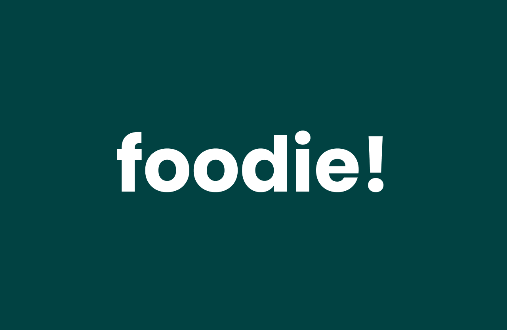
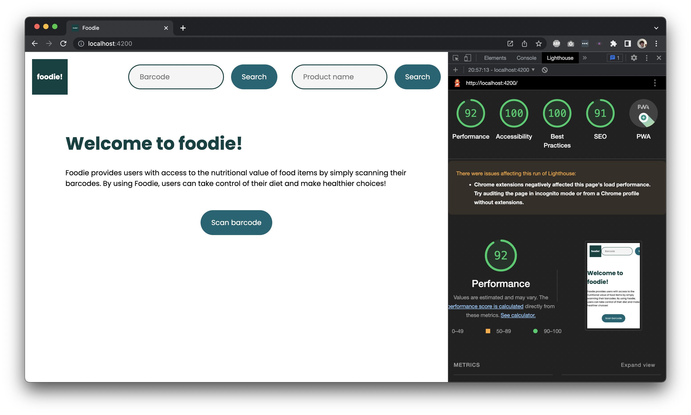

# foodie!

A website that allows it's users to scan barcodes of food related items to access nutritional data.

## Live site

[Live site](https://outrageous-tutu-clam.cyclic.app/).

## Description

This repository hosts the project I created during the three week course [Progressive Web Apps](https://github.com/cmda-minor-web/progressive-web-apps-2223/) of the minor [Web Design and Development](https://everythingweb.org/). During this course I was challenged to use server-side rendering.

## Installation

> **NOTE:** Before you can install this project be sure to have both [Node.js](https://nodejs.org/en/download/) and NPM installed. NPM should automatically be installed when installing Node.js. An installation of [Git]() is also required.

You can install the project locally by running the following command in your local folder.

- `git clone https://github.com/Steinberg99/progressive-web-apps-2223/`

When you have cloned the repository be sure to run the command `npm install` to install all of the project dependencies. Run this command in the root folder of the project. When you have done this you can run the command `npm start` to start the project. The website should run in the browser when visiting `localhost:4200`.

# Lighthouse score

# Performance

To improve the performance of foodie! I implemented the following features:

- A service worker to cache core assets and pages.
- HTTP caching op the server.
- Minifying of client side Javascript and CSS files.
- Server side rendering.
- Downloaded font files with a fallback font.

# Technologies

DogeMeet makes use of the following technologies:

- [Node.js](https://nodejs.org/en/download/),
- [Express](https://expressjs.com/),
- [Pug](https://pugjs.org/api/getting-started.html),

# License

MIT License
